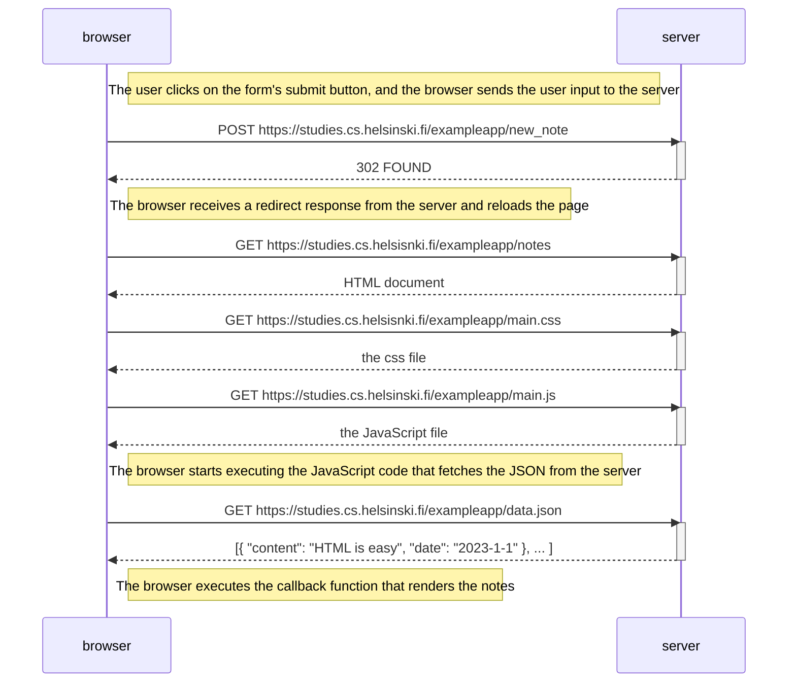

```mermaid
sequenceDiagram
    participant browser
    participant server

    Note right of browser: The user clicks on the form's submit button, and the browser sends the user input to the server
 
    browser->>server: POST https://studies.cs.helsinski.fi/exampleapp/new_note
    activate server
    server-->>browser: 302 FOUND
    deactivate server

    Note right of browser: The browser receives a redirect response from the server and reloads the page
    browser->>server: GET https://studies.cs.helsisnki.fi/exampleapp/notes
    activate server
    server-->>browser: HTML document
    deactivate server
    
    browser->>server: GET https://studies.cs.helsisnki.fi/exampleapp/main.css
    activate server
    server-->>browser: the css file
    deactivate server

    browser->>server: GET https://studies.cs.helsinski.fi/exampleapp/main.js
    activate server
    server-->>browser: the JavaScript file
    deactivate server

    Note right of browser: The browser starts executing the JavaScript code that fetches the JSON from the server

    browser->>server: GET https://studies.cs.helsinski.fi/exampleapp/data.json
    activate server
    server-->>browser: [{ "content": "HTML is easy", "date": "2023-1-1" }, ... ]
    deactivate server

    Note right of browser: The browser executes the callback function that renders the notes
```